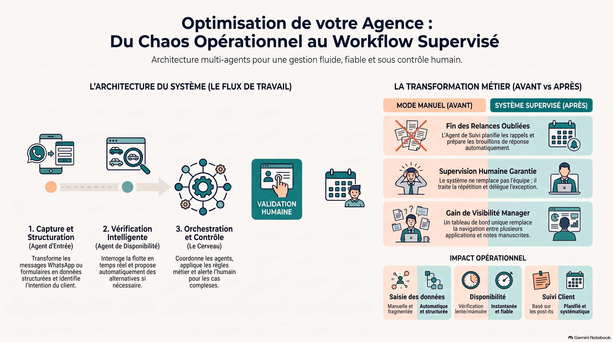

# AutoFlow — système d'automatisation intelligent des workflows d'entreprise

**Projet de stage · AI Engineer — automatisation des workflows métier**
**Cas d'application :** agence de location de voitures, Rabat · **Statut :** V1 démontrable (données fictives, aucun gain chiffré revendiqué)

> Un workflow **supervisé** : le système structure les demandes, vérifie la disponibilité, prépare réponses et relances, trace tout — et **transmet à une personne** tout cas ambigu ou sensible. Il prépare ; l'équipe décide.

<p align="center"></p>

## Architecture en une phrase

**1 orchestrateur LangGraph + 3 agents spécialisés + humain dans la boucle.**

```
Demande (WhatsApp · Facebook · formulaire · n8n)
   → Agent Intake        structure + preuves textuelles + confiance par champ
   → Orchestrateur       routage par règles (rules.json), machine à 10 états, journal
   → Agent Disponibilité déterministe (0 LLM) : options / alternatives / raisons
   → Agent Suivi         brouillon FR (prix injecté), relance +24 h, lead sans réponse à 72 h
   → Validation humaine  interrupt() : approuver · modifier · refuser · compléter
   → Espace admin        file à valider, suivi en direct (raisonnement), KPI auditables
```

## Démarrer en 2 minutes

```bash
# API (Python 3.12+) — tourne hors ligne, LLM optionnel
cd backend && python -m venv ../.venv && ../.venv/Scripts/activate && pip install -r requirements.txt
cp .env.example .env && python -m uvicorn app.main:app --reload --port 8000

# Espace admin
cd frontend && npm install && npm run dev        # http://localhost:5173 · token : change-me-admin
```

Le premier démarrage génère une agence « vivante » : 24 véhicules, 80 réservations, 40 clients et **6 semaines d'historique rejouées à travers le vrai graphe** (45 demandes, ~370 événements). Barre latérale → *Scénario A–E*, *+24 h*, *Reset*.

Tests : `cd backend && pytest -q` (16 tests : 8 scénarios e2e + 7 simulations métier). Évaluation : `python -m eval.eval_intake`. Menu **Simulations** dans l'admin : les mêmes cas jouables en direct, étape par étape, avec les vérifications.

## Ce qui rend le projet crédible

| Pour le jury | Pour le gérant |
|---|---|
| Graphe LangGraph réel avec `interrupt()` / `Command(goto)` et checkpoints | Aucune disponibilité inventée : c'est du code, pas une IA |
| Extraction *evidence-gated* + signaux calibrés (« probabilités, pas prose ») | Rien n'est envoyé au client sans un clic humain |
| Matrice d'escalade explicite, transitions légales, journal d'événements | Une file claire : qui doit décider quoi, et pourquoi |
| 16 tests · 7 simulations métier jouables · 100 % des erreurs d'extraction rattrapées par l'humain | Coût d'infrastructure ≈ 0 MAD, LLM optionnel |
| Panneau **Suivi en direct** : chemin allumé + chaque règle, valeur, seuil | KPI = compteurs mesurés, jamais des promesses |

## Arborescence

```
AutoFlow/
├── backend/            FastAPI + LangGraph + SQLAlchemy · data/ (jeu réaliste) · tests/ · eval/
├── frontend/           Espace admin React + Vite + TS (Vercel / Netlify)
├── integrations/n8n/   Webhook d'entrée + notifications (n8n notifie, n'envoie jamais)
├── docs/               Dossier : cahier des charges, architecture (7 vues), choix techniques,
│   ├── diagrams/       démo & déploiement, évaluation, rapport de stage, portfolio
│   ├── assets/         4 diagrammes HTML+SVG dark exportables PNG/PDF · visuels de référence
│   └── kit_prospection/ Kit commercial complet (brief, audit, proposition, script, vidéo)
└── docker-compose.yml
```

## Dossier

0. [Contexte — source de vérité](docs/00-CONTEXTE.md) · 1. [Cahier des charges](docs/01-cahier-des-charges.md) · 2. [Architecture](docs/02-architecture.md) · 3. [Choix techniques & état de l'art 2026](docs/03-choix-techniques.md) · 4. [Démo, données, déploiement](docs/04-demo-et-deploiement.md) · 5. [Évaluation](docs/05-evaluation.md) · 6. [Rapport de stage](docs/06-rapport-de-stage.md) · 7. [Portfolio & entretien](docs/07-portfolio.md) · 8. [Rapport de stage complet](docs/08-rapport-de-stage-complet.md)

Diagrammes : [contexte](docs/diagrams/01-contexte.html) · [conteneurs](docs/diagrams/02-conteneurs.html) · [workflow](docs/diagrams/03-workflow.html) · [déploiement](docs/diagrams/04-deploiement.html)

## Stack

Python 3.12+ · LangGraph 1.2 · LangChain (Anthropic / OpenAI / Ollama, optionnel) · FastAPI · SQLAlchemy 2 · SQLite → PostgreSQL · React 19 · Vite · TypeScript · mermaid · n8n · Docker · Vercel / Netlify.

Licence : MIT. Données : fictives, téléphones masqués. Loi 09-08 : à cadrer avec l'agence avant tout usage de données réelles.
