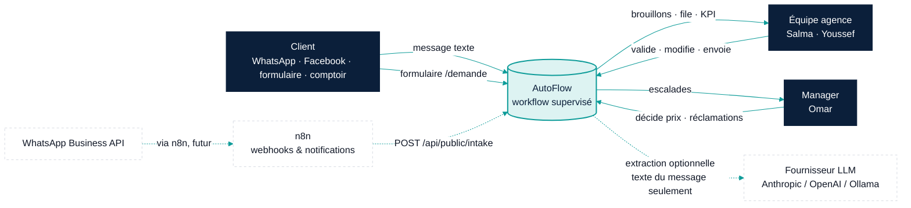
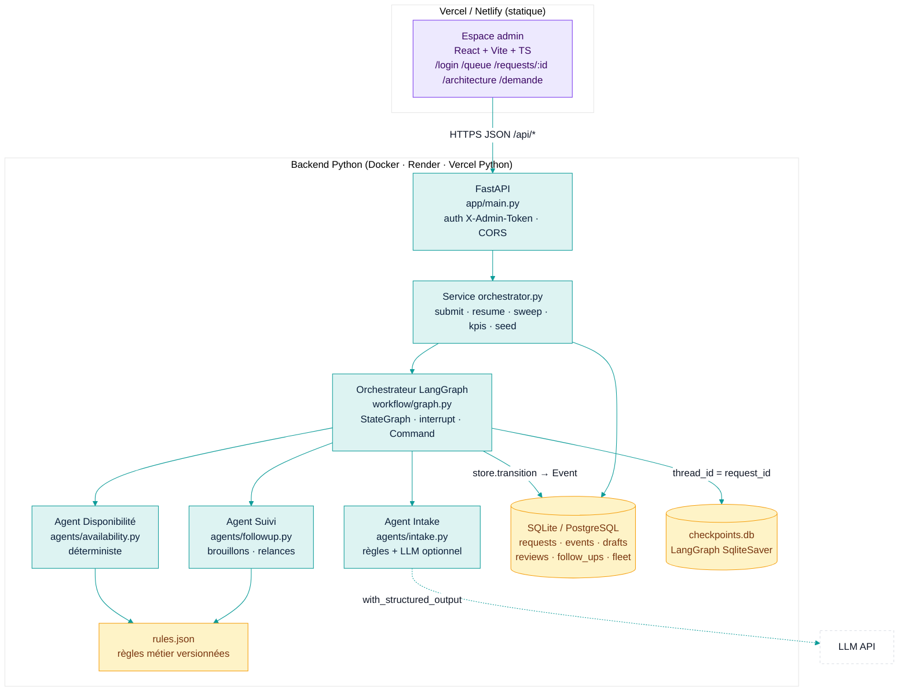
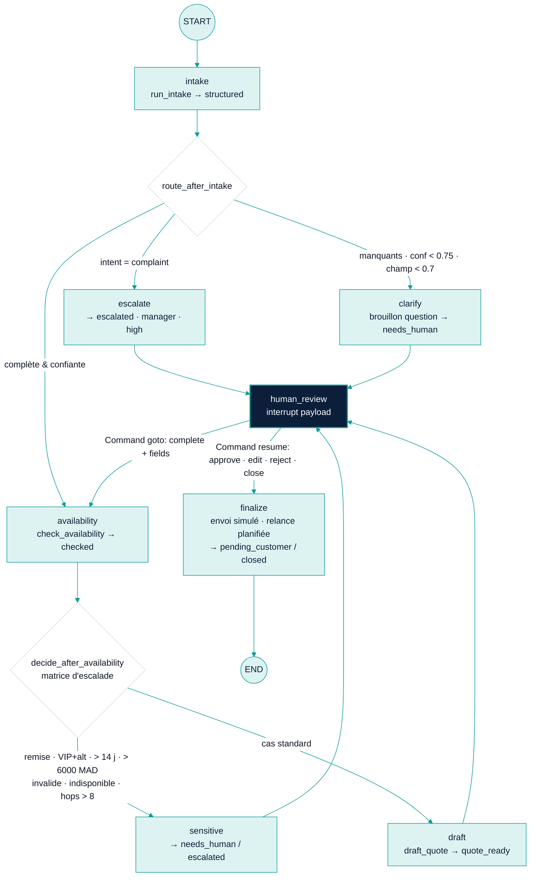
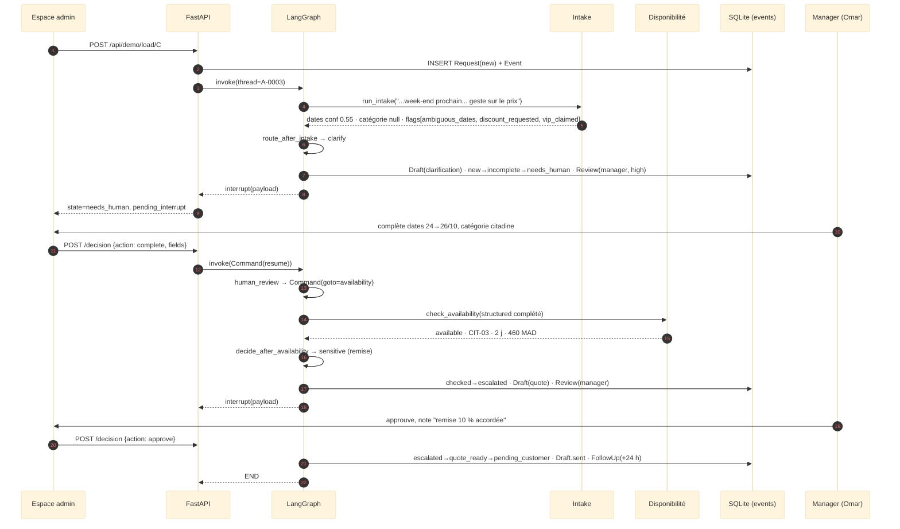
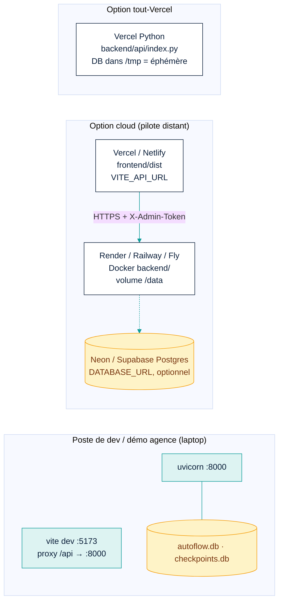

# 02 — Architecture d'AutoFlow

> Vues produites selon la méthode *architecture-mapper* : une question par diagramme, jamais tout le système sur un seul schéma.
> Convention : trait plein = **FACT** (vérifié dans le code) · trait pointillé = **HYPOTHESIS** (futur / à valider avec l'agence).

## 2.1 Vue contexte — qui parle au système ?



**Frontière clé (FACT)** : AutoFlow n'envoie jamais un message au client. Il produit des brouillons ; une personne clique « envoyer ».

## 2.2 Vue conteneurs — de quoi est fait le système ?



## 2.3 Vue composants — le graphe LangGraph



Le graphe réel est exposé par `GET /api/graph` (`draw_mermaid()`) et affiché dans l'onglet *Architecture* de l'espace admin — le diagramme et le code ne peuvent pas diverger.

## 2.4 Vue flux de données — que devient un message ?

```text
Message brut (str, fr/darija)
  → Intake : normalisation NFD · regex dates FR · mots-clés · [LLM structured output + preuve verbatim]
  → StructuredRequest {intent, dates ISO, catégorie, boîte, lieux, flags[], field_confidence{}, confidence, missing[], evidence{}}
  → Orchestrateur : seuils (rules.json) → route
  → Disponibilité : SELECT vehicles, bookings → chevauchement + tampon 4 h + maintenance → AvailabilityResult {status, options[], alternatives[], reasons[]}
  → Matrice d'escalade (règles) → review {level, priority, reason}
  → Suivi : template FR + injection prix depuis la table (jamais généré) → FollowUpOutput {draft_kind, draft_fr, action}
  → interrupt() : payload persisté (checkpoint) ; DB : Request.state, Draft, Review, Event
  → Décision humaine (JSON) → Command(resume) → finalize : Draft.sent_at, FollowUp.due_at = now + 24 h, Event
  → Sweep (à chaque chargement du dashboard) : FollowUp due → brouillon relance ; > 72 h → stalled → needs_human
  → KPI = agrégats sur events/drafts/follow_ups (jamais stockés)
```

## 2.5 Vue séquence — scénario C (ambiguë + remise)



## 2.6 Vue déploiement



Secrets : `ADMIN_TOKEN`, clés LLM — variables d'environnement uniquement, jamais dans le code. Le frontend ne contient aucun secret : le token est saisi à la connexion.

## 2.7 Vue défaillances — que se passe-t-il quand ça casse ?

| Défaillance | Détection | Comportement | Chemin de secours | Visible par |
|---|---|---|---|---|
| LLM indisponible / clé invalide | exception dans `extract_llm` | flag `llm_failed:*`, confiance × 0.9, résultat des règles conservé | rules-only (toujours calculé) | onglet Structurée (`engine`) |
| LLM invente un champ | preuve absente du message | champ rejeté (`null`), confiance 0 | question de clarification | flags / manquants |
| Dates ambiguës (« week-end prochain ») | conf 0.55 < 0.7 | `needs_human` + brouillon de question | staff complète → `Command(goto=availability)` | file à valider |
| Table flotte périmée | `fleet_snapshot_at` sur chaque résultat | résultat horodaté | staff relit avant envoi | onglet Disponibilité |
| Crash pendant le workflow | checkpoint LangGraph par nœud | reprise au dernier nœud persisté | `graph.get_state(thread)` | — |
| Boucle agents | `hops > MAX_HOPS (8)` | route `sensitive` → humain | — | raison de revue |
| Transition illégale | `TRANSITIONS` dans `store.transition` | `IllegalTransition` → HTTP 409 | — | message d'erreur UI |
| Trop de relances | `max_reminders = 2` | plus de planification, `stalled` → appel recommandé | staff clôture | onglet Relance |
| Demande orpheline | toute demande est dans un état de `STATES` ; KPI `by_state` couvre 100 % | — | — | tableau de bord |

## 2.8 Inventaire d'architecture

| Élément | Responsabilité | Interface | Données possédées | Techno | Dépend de | Impact si HS | Preuve |
|---|---|---|---|---|---|---|---|
| Espace admin | file, décisions, KPI, démo | HTTP JSON | token (localStorage) | React 19, Vite, TS, mermaid | API | plus de validation humaine possible | `frontend/src` |
| FastAPI | auth, routes, sérialisation | REST `/api/*` | — | FastAPI 0.141 | service, DB | tout | `backend/app/main.py` |
| Orchestrateur | routage, états, interrupt, matrice d'escalade | `invoke`, `Command` | checkpoints | LangGraph 1.2 | agents, store, rules | workflow figé | `workflow/graph.py` |
| Intake | message → structuré + preuves | `run_intake()` | — | regex/unicodedata, LangChain optionnel | LLM (opt.) | tout passe en `needs_human` | `agents/intake.py` |
| Disponibilité | options/alternatives/raisons | `check_availability()` | — | Python pur | vehicles, bookings, rules | pas de devis | `agents/availability.py` |
| Suivi | brouillons FR, relances, action | `draft_*`, `recommend_*` | — | templates | rules | pas de brouillon | `agents/followup.py` |
| Store | transitions légales + journal | `transition/log/…` | events, drafts, reviews, follow_ups | SQLAlchemy 2 | DB | perte de traçabilité | `workflow/store.py` |
| Règles | seuils, replis, politique de relance | `load_rules()` | rules.json | JSON | — | valeurs par défaut | `rules.py`, `data/rules.json` |
| Horloge démo | temps contrôlable | `now()/advance()` | settings | — | DB | relances non testables | `clock.py` |
