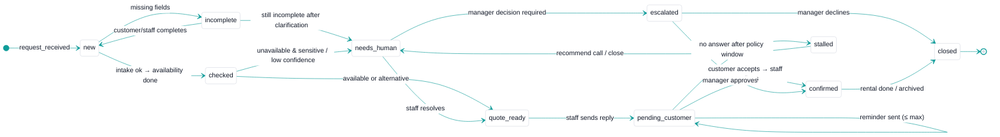
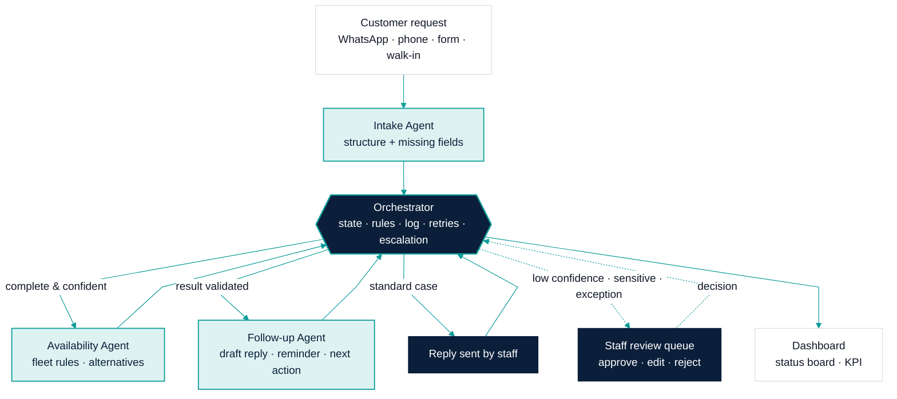
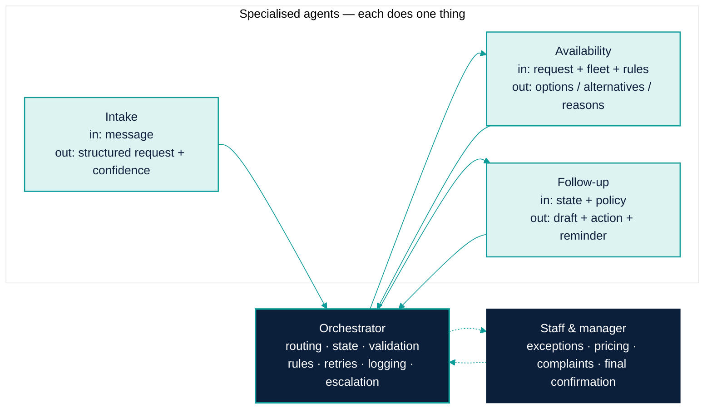

# Solution Architecture — Supervised Request Workflow for a Car Rental Agency

**Scope:** pilot prototype · **Stack target:** Python, state-machine/LangGraph workflow, SQLite/CSV, Streamlit
**Status:** design proposal, pre-audit. Business assumptions are hypotheses until validated.

---

## Résumé exécutif (FR)

Ce document décrit l'architecture d'un **workflow supervisé** pour le traitement des demandes clients d'une agence de location de voitures.

Le système est volontairement compact : **un orchestrateur, trois agents spécialisés, et l'équipe de l'agence dans la boucle**.

- **Comprendre la demande** (Intake) : extrait dates, catégorie de véhicule, lieu et contraintes ; signale ce qui manque.
- **Vérifier la disponibilité** (Availability) : applique les règles de l'agence sur la table de flotte, propose une alternative, n'invente jamais une disponibilité.
- **Relancer et suivre** (Follow-up) : rédige un brouillon de réponse, planifie une relance, détecte les devis sans suite, recommande la prochaine action.
- **Coordonner et sécuriser** (Orchestrateur) : route les tâches, tient l'état de chaque demande, valide les sorties des agents, journalise tout, applique les règles, gère les échecs, et **transmet à un humain** tout cas ambigu ou sensible.
- **L'équipe décide** : prix spéciaux, réclamations, cas flous, confirmation finale.

L'orchestrateur est le cœur du système : c'est lui qui garantit qu'aucune demande ne se perd, qu'aucune décision sensible n'est prise sans une personne, et que tout est mesurable.

Périmètre du pilote : demandes de devis/réservation simples, données simulées ou anonymisées, tableau de bord de statut et d'indicateurs. Hors périmètre : paiement, tarification dynamique, intégrations externes, actions autonomes.

---

## 1. Architecture rationale

### Why this shape

| Design choice | Reason |
|---|---|
| One orchestrator + three narrow agents | Each agent has a single, testable responsibility. The orchestrator owns state, rules and safety, which is where reliability lives. Adding agents adds failure surface, not value. |
| Human-in-the-loop as a first-class state | Rental decisions involve money, identity and customer emotion. Escalation is a *feature* that builds owner trust; it is not a fallback for weak AI. |
| Explicit state machine | The owner's real question is "where is this request?" — a state machine answers it deterministically and makes KPIs trivial to compute. |
| Optional LLM, mandatory rules | Extraction and drafting may use an LLM; availability and business rules are deterministic code. The system must never hallucinate a free vehicle. |
| Local, simple data (CSV/SQLite) | A pilot must run on a laptop with mock data before any integration. Migration to PostgreSQL is a config change, not a redesign. |

### What we deliberately exclude from the pilot

Dynamic pricing, payment, predictive maintenance, voice, multi-channel connectors (real WhatsApp API), autonomous confirmation, CRM sync. Each is a "future scope" item gated by audit evidence.

---

## 2. System boundary

```
┌───────────────────────────────────────────────────────────────────────┐
│  INSIDE THE SYSTEM (pilot)                                            │
│                                                                       │
│  Request ingestion (manual paste / form / CSV import of messages)     │
│  Intake Agent · Availability Agent · Follow-up Agent                  │
│  Orchestrator (state, routing, validation, rules, retries, log)       │
│  Human review queue (staff UI)                                        │
│  Fleet availability table (mock or anonymised export)                 │
│  Request store + event log (SQLite)                                   │
│  Streamlit dashboard (status board + KPI placeholders)                │
└───────────────────────────────────────────────────────────────────────┘
        ▲ inputs                                    outputs ▼
  Customer messages (copied in)               Draft replies (staff sends)
  Fleet table (agency-provided)               Follow-up reminders (in-app)
  Business rules (agency-configured)          Status + KPI view (manager)
                                              Escalation items (staff)

OUTSIDE (not in pilot): actual WhatsApp/phone/Facebook connectors,
payment, contract generation, external CRM/ERP, customer-facing bot.
```

**Key boundary rule:** in the pilot, **the system never sends a message to a customer by itself.** It produces drafts; a staff member sends. This is both a safety measure and an adoption measure.

---

## 3. Component specifications

### 3.1 Intake Agent — "Comprendre la demande"

| Aspect | Specification |
|---|---|
| **Business purpose** | Turn an unstructured customer message into a complete, structured request — or say precisely what is missing. |
| **Inputs** | Raw message text; channel; timestamp; optional known customer profile; optional prior conversation turns. |
| **Responsibilities** | Classify intent (`info`, `quote`, `reservation`, `modification`, `complaint`, `other`). Extract `pickup_date`, `return_date`, `vehicle_category`, `pickup_location`, `return_location`, `budget`, `extras`, `constraints`. Detect missing/ambiguous fields. Draft one short clarification question in French if needed. Emit a confidence score per field and overall. |
| **Outputs** | `StructuredRequest` + `confidence` + `missing_fields[]` + `clarification_draft?` |
| **Decision point** | None — the Intake Agent never decides. It reports; the orchestrator decides. |
| **Failure modes** | Wrong intent → orchestrator routes `complaint` mis-tagged as `quote` (mitigation: complaint keywords force human review). Wrong date parsing (e.g., "12/03" DD/MM vs MM/DD) → mitigation: locale fixed to fr-MA, ambiguous dates flagged `confidence < 0.7`. Hallucinated field → mitigation: every extracted field must cite a text span; fields without evidence are set to `null`. LLM unavailable → mitigation: rule-based regex fallback with lower confidence; request enters `incomplete` for human completion. |

### 3.2 Availability Agent — "Vérifier la disponibilité"

| Aspect | Specification |
|---|---|
| **Business purpose** | Give a truthful, explainable answer: what is available, what alternative exists, or why nothing fits. |
| **Inputs** | `StructuredRequest` (complete); fleet table (`vehicle_id, category, status, location, maintenance_until, bookings[]`); rules (`min_days`, `max_days`, `category_fallbacks`, `location_rules`, `buffer_hours`). |
| **Responsibilities** | Deterministic date-overlap check against bookings and maintenance holds. Apply rule filters. Rank matching vehicles. If none: search fallback categories and nearby dates (± N days if allowed). Return reasons for every exclusion. |
| **Outputs** | `AvailabilityResult { status: available \| alternative \| unavailable, options[], alternatives[], reasons[] }` |
| **Decision point** | None automated beyond ranking. "Alternative accepted" is always a customer + staff decision. |
| **Failure modes** | Stale fleet table → wrong answer (mitigation: table timestamp shown on every result; results older than X hours flagged). Rule misconfiguration → over/under-restrictive results (mitigation: rules are versioned config, tested with fixtures). Empty fleet / missing category → explicit `unavailable` with reason, never an empty success. **This agent contains no LLM call**: hallucination is structurally impossible. |

### 3.3 Follow-up Agent — "Relancer et suivre"

| Aspect | Specification |
|---|---|
| **Business purpose** | Make sure no request dies in silence after a reply or quote. |
| **Inputs** | Request state + history; `AvailabilityResult`; last customer response timestamp; follow-up policy (`first_reminder_after_h`, `max_reminders`, `stale_after_h`); message tone guidelines. |
| **Responsibilities** | Draft a customer-friendly reply in French (quote, alternative proposal, or clarification). Schedule reminder(s) when a reply is sent and no answer arrives. Detect stalled leads. Recommend next best action: `reply`, `remind`, `call`, `escalate`, `close`. Log each recommendation. |
| **Outputs** | `draft_message`, `action_recommendation`, `follow_up_status`, `next_check_at` |
| **Decision point** | Recommendation only. Staff executes (sends / calls / closes). |
| **Failure modes** | Over-reminding → customer irritation (mitigation: hard cap `max_reminders`, staff can snooze/cancel). Draft with wrong price → mitigation: prices are injected from rules/table, never generated; draft shows source fields. Timer drift / missed scheduled check → mitigation: orchestrator sweeps stale states on every run, not only on timers. |

### 3.4 Orchestrator / Middleware — "Coordonner et sécuriser"

| Aspect | Specification |
|---|---|
| **Business purpose** | Guarantee that every request has an owner, a state, a trace, and a safe path to a human when needed. |
| **Inputs** | Events: `request_received`, agent outputs, staff actions (`approve`, `edit`, `reject`, `close`), timer ticks. |
| **Responsibilities** | **Routing** between agents by state. **State tracking** per request (see §5). **Validation** of every agent output against a schema and against business rules (e.g., no quote without complete dates). **Retries** with backoff for transient failures; circuit to `escalated` after N failures. **Logging** of every transition with actor, timestamp, payload hash. **Business rules** enforcement (min duration, deposit policy, VIP flag). **Escalation** triggers (see §4). **Human handoff** queue with context bundle. **KPI event emission**. |
| **Outputs** | Persisted state, event log, human review items, dashboard data. |
| **Decision point** | The only automated decision-maker — and its decisions are limited to *routing*, never to *business commitments*. |
| **Failure modes** | Crash mid-transition → mitigation: transitions are atomic writes with idempotent event IDs; replay on restart. Infinite loop between agents → mitigation: max hops per request, then escalate. Silent drop → mitigation: every request must be in a terminal or active state; a nightly consistency check lists orphans. Rule conflict → mitigation: rules evaluated in fixed priority order; conflicts logged and escalated. |

### 3.5 Human-in-the-loop — "L'équipe décide"

Staff interact through a review queue. Each item carries: original message, structured request, availability result, draft reply, reason for escalation, suggested action. Staff can **approve**, **edit then approve**, **reject with reason**, **reassign**, or **close**. Every action is logged and feeds KPIs.

---

## 4. Human-in-the-loop decision matrix

| Trigger | Condition | Route | Who | System may act alone? |
|---|---|---|---|---|
| Low extraction confidence | overall `confidence < 0.75` or any critical field `< 0.7` | `needs_human` | Agent staff | No |
| Missing critical field after 1 clarification | still missing `dates` or `category` | `needs_human` | Agent staff | No |
| Ambiguous identity / duplicate customer | fuzzy match on phone/name | `needs_human` | Agent staff | No |
| Intent = `complaint` | any | `escalated` (priority) | Manager | No |
| Special price / discount requested | keywords or explicit field | `escalated` | Manager | No |
| Requested vehicle unavailable AND customer flagged VIP/repeat | rule | `needs_human` | Agent staff | No |
| Long rental / high value | `days > rule.max_auto_days` or `est_value > threshold` | `needs_human` | Manager | No |
| Final reservation confirmation | always in pilot | `needs_human` | Agent staff | **Never in pilot** |
| Agent failure after retries | 3 failures | `escalated` | Agent staff | No |
| Standard quote, complete data, high confidence, vehicle available | all true | `quote_ready` → staff sends draft | Agent staff | Prepares draft only |
| Reminder due, no customer answer | policy | `pending_customer` + reminder draft | Agent staff | Prepares draft only |

Principle: **the system prepares; people commit.**

---

## 5. Workflow state machine



### State definitions

| State | Meaning | Owner | Exit condition |
|---|---|---|---|
| `new` | Received, not yet structured | System | Intake output validated |
| `incomplete` | Missing critical info | System → customer/staff | Fields completed |
| `checked` | Availability computed | System | Result validated |
| `quote_ready` | Draft reply ready for staff | Staff | Staff sends |
| `pending_customer` | Waiting for customer | System (timers) + staff | Customer replies / window expires |
| `stalled` | No answer beyond policy | Staff | Action taken |
| `needs_human` | Requires staff judgement | Staff | Resolved |
| `escalated` | Requires manager | Manager | Decision |
| `confirmed` | Reservation confirmed by a person | Staff | Rental completed |
| `closed` | Terminal (won, lost, cancelled, resolved) | — | — |

Every transition writes an event: `{request_id, from, to, actor, reason, ts, payload_ref}`.

---

## 6. End-to-end flow (Mermaid)



## 7. Agent roles (Mermaid)



---

## 8. Data model proposal (pilot)

```
customers      (id, name, phone_hash, email?, is_vip, notes, created_at)
requests       (id, customer_id?, channel, raw_message, received_at,
                intent, pickup_date, return_date, vehicle_category,
                pickup_location, return_location, budget, extras_json,
                confidence, missing_fields_json, state, assigned_to?, updated_at)
vehicles       (id, plate_masked, category, model, location, status,
                maintenance_until?, daily_rate)
bookings       (id, vehicle_id, request_id?, start_dt, end_dt, status)
availability_results (id, request_id, status, options_json, alternatives_json, reasons_json, fleet_snapshot_at, computed_at)
drafts         (id, request_id, kind, body_fr, generated_at, sent_by?, sent_at?, edited)
follow_ups     (id, request_id, due_at, reminder_no, status, outcome?)
reviews        (id, request_id, reason, priority, assigned_to?, opened_at, closed_at?, decision?, note)
events         (id, request_id, from_state, to_state, actor, reason, ts, payload_ref)
rules          (key, value_json, version, updated_at)
```

KPI queries derive from `events`, `drafts`, `follow_ups`, `reviews`. No KPI is stored as a number; all are computed from timestamps to keep them auditable.

---

## 9. Security & privacy assumptions

- **Data minimisation:** pilot uses mock data or anonymised exports; phone numbers hashed; no ID scans stored.
- **No outbound messaging** in pilot: the system cannot contact customers.
- **Local-first:** SQLite on an agency-controlled machine; if an LLM API is used, only the message text is sent, never the fleet or customer table; provider and retention documented and agreed with the owner.
- **Access:** two roles (staff, manager); manager-only for rule changes and escalation decisions.
- **Auditability:** every automated output is traceable to inputs and rule version.
- **Right to delete:** requests deletable by ID with cascading events.
- **Compliance note:** Moroccan Law 09-08 on personal data protection applies; the pilot agreement will state purpose, retention and consent handling. (To be confirmed with the owner.)

---

## 10. Prototype scope vs future scope

| Area | Prototype (pilot) | Future (audit-gated) |
|---|---|---|
| Ingestion | Manual paste / form / CSV import | WhatsApp Business API, Facebook, telephony transcripts |
| Intake | LLM or rule extraction, French + Darija-tolerant | Multi-language, voice |
| Availability | Deterministic rules on local table | Live sync with booking system |
| Follow-up | Drafts + in-app reminders | Scheduled outbound with staff approval |
| Human loop | In-app queue | Mobile notifications, SLA tracking |
| Dashboard | Streamlit status + KPI placeholders | Role-based reporting, exports |
| Data | SQLite/CSV mock or anonymised | PostgreSQL, backups |
| Pricing | Fixed rates from table | Manager-approved dynamic pricing (only if requested) |

---

## 11. Open technical decisions (to close in Phase 2)

1. LangGraph vs hand-written state machine — decision rule: use LangGraph only if it simplifies retries/branching without hiding state; otherwise plain Python + explicit transition table.
2. LLM provider and on/off switch — pilot must run fully with rule-based extraction if the owner refuses external calls.
3. Reminder execution — polling sweep on dashboard load vs background scheduler; pilot starts with sweep.
