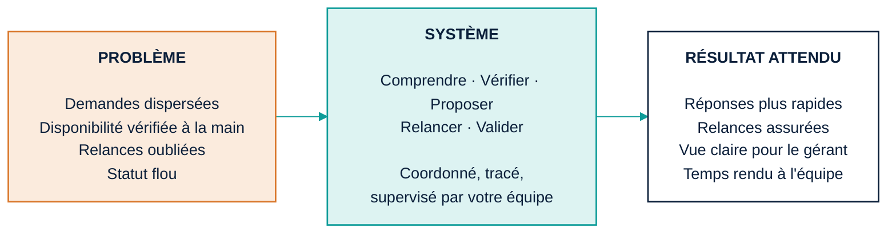
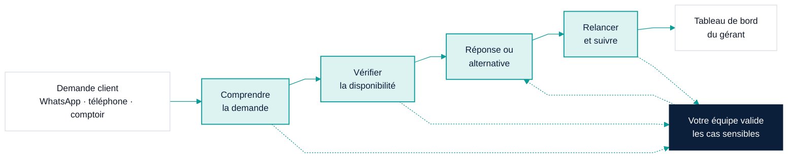
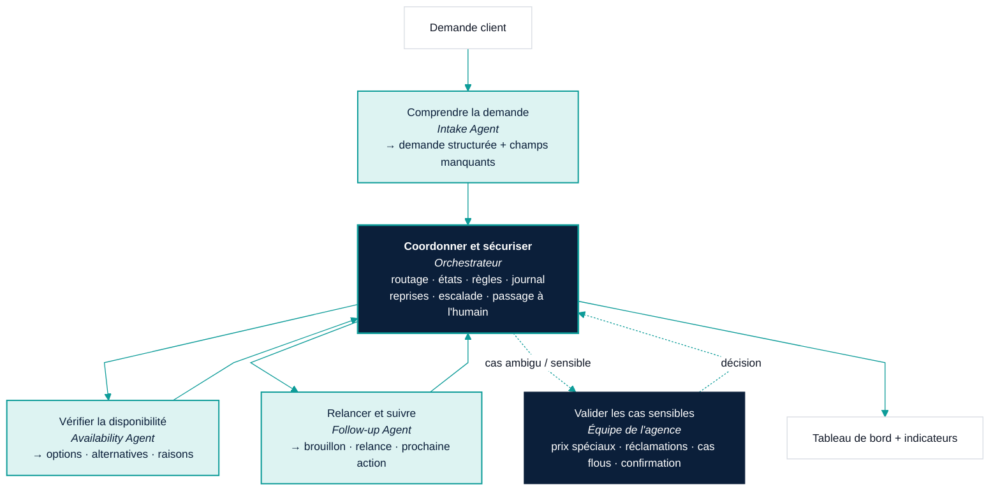
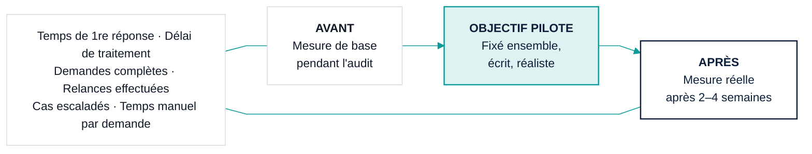

# 05 — Brief visuel & sources Mermaid

**Rôle de ce document :** index de tous les visuels du kit, principes de design, et source Mermaid des cinq diagrammes de base demandés. Les six livrables visuels détaillés (A → F) vivent dans `visuals/`.

---

## 0. Principes non négociables

1. **Un visuel = une décision ou une histoire.** Pas plus de 5–7 éléments clés par visuel principal.
2. **Commencer par la douleur, jamais par la technologie.** Séquence obligatoire : *Difficulté opérationnelle → Workflow intelligent → Supervision humaine → Résultat métier.*
3. **Chaque couleur a un sens** (voir [visuals/00_design_system.md](visuals/00_design_system.md)) : navy = humain/structure, teal = système, orange = friction.
4. **Chaque flèche signifie quelque chose.** Pleine = flux ; pointillée = escalade ou retour humain.
5. **Libellés pour un gérant**, nom d'agent en second niveau, en petit et gris.
6. **Lisible sur téléphone.** Testé en 1080 × 1080 avant tout autre format.
7. **Aucun résultat inventé.** Placeholders `— à mesurer —`.
8. **Version exécutive + version technique** dès que le visuel sert deux publics.

---

## 1. Index des livrables visuels

| Réf. | Livrable | Fichier | Message unique | Formats |
|---|---|---|---|---|
| 00 | Système visuel partagé | `visuals/00_design_system.md` | — | — |
| A | Proposition exécutive une page | `visuals/A_executive_one_page.md` | « Un workflow clair, rapide, supervisé » | A4, 1080², carrousel |
| B | Carte Avant / Après | `visuals/B_before_after_workflow_map.md` | « Même équipe, moins de friction » | A4 paysage, 1080² |
| C | Architecture multi-agents | `visuals/C_multi_agent_architecture.md` | « Un système fiable, pas une boîte noire » | A4, 16:9 |
| D | Parcours employé | `visuals/D_employee_journey.md` | « L'employé reste au centre » | 1080², 16:9 |
| E | Tableau d'impact KPI | `visuals/E_kpi_impact_board.md` | « Mesuré, pas promis » | 16:9, A4 |
| F | Feuille de route pilote | `visuals/F_pilot_roadmap.md` | « Six étapes, une décision » | A4 paysage, 16:9 |

Ordre recommandé en réunion / carrousel : **A → B → D → C → E → F**. (La douleur et la relation humaine avant l'architecture ; les indicateurs et la route avant la demande d'engagement.)

---

## 2. Les cinq diagrammes de base — source Mermaid

Tous utilisent le thème commun. Bloc `%%{init}` abrégé ici ; version complète dans `00_design_system.md`.

### 2.1 Problème → Système → Résultat (triptyque exécutif)

**Message :** en trois blocs, le lecteur sait ce qui coince, ce qu'on propose, ce qu'il y gagne.



### 2.2 Workflow de bout en bout (version exécutive)

**Message :** une demande suit un chemin simple ; l'humain intervient là où ça compte.



### 2.3 Agents et orchestrateur (version technique lisible)

**Message :** trois agents étroits, un orchestrateur qui tient l'état et la sécurité, une équipe qui décide.



### 2.4 Avant / Après — parcours employé

**Message :** même personne, mêmes responsabilités, moins de friction.

```mermaid
%%{init: {"theme":"base","themeVariables":{"fontFamily":"Manrope, Inter, system-ui","fontSize":"13px","lineColor":"#0E9C99","primaryColor":"#FFFFFF","primaryBorderColor":"#D8DCE3","primaryTextColor":"#111827","background":"#FAF8F4","clusterBkg":"#FAF8F4","clusterBorder":"#D8DCE3"},"flowchart":{"curve":"linear"}}}%%
flowchart LR
    classDef friction fill:#FBEBDD,color:#0B1F3A,stroke:#D9772B,stroke-width:1.5px;
    classDef system fill:#DDF3F2,color:#0B1F3A,stroke:#0E9C99,stroke-width:1.5px;
    classDef human fill:#0B1F3A,color:#FFFFFF,stroke:#0B1F3A;

    subgraph AV["AVANT — tout à la main"]
        direction LR
        a1["Recevoir<br/>la demande"]:::friction --> a2["Chercher<br/>les infos"]:::friction --> a3["Vérifier<br/>la dispo"]:::friction --> a4["Répondre<br/>à la main"]:::friction --> a5["Risque d'oublier<br/>la relance"]:::friction --> a6["Mettre à jour<br/>le statut"]:::friction
    end

    subgraph AP["APRÈS — l'employé pilote, le système prépare"]
        direction LR
        b1["Recevoir<br/>la demande"]:::human --> b2["Demande<br/>structurée"]:::system --> b3["Dispo<br/>vérifiée"]:::system --> b4["Réponse<br/>suggérée"]:::system --> b5["Relance<br/>rappelée"]:::system --> b6["Confirmation humaine<br/>des exceptions"]:::human
    end

    AV ~~~ AP
```



### 2.5 Mesure des KPI (boucle de mesure honnête)

**Message :** on mesure avant, on fixe un objectif, on mesure après. Rien n'est promis.



---

## 3. Formats de sortie et export

| Format | Dimensions | Usage | Note |
|---|---|---|---|
| PDF A4 portrait | 210 × 297 mm, 300 dpi | Proposition envoyée, impression réunion | Police embarquée, marges 18 mm |
| PDF A4 paysage | 297 × 210 mm | Cartes B, F | — |
| Carré | 1080 × 1080 px | WhatsApp, LinkedIn post | Texte ≥ 28 px |
| Carrousel LinkedIn | 1080 × 1350 px, 6–8 pages | Séquence A → F | Une idée par page |
| 16:9 | 1920 × 1080 px | Jury, réunion projetée | Marges de sécurité 5 % |

Export Mermaid : rendu via `mmdc` (mermaid-cli) en SVG, puis import dans Figma/Canva pour la mise en page finale. Le Mermaid est la *source de vérité de la structure* ; la finition visuelle se fait dans l'outil de design.

```bash
npx -y @mermaid-js/mermaid-cli -i diagram.mmd -o diagram.svg -b "#FAF8F4" -w 1600
```

---

## 4. Revue finale — grille commune

Chaque visuel A → F est validé contre les sept questions de `00_design_system.md §10`. Un « non » = redesign, pas de correctif cosmétique.
