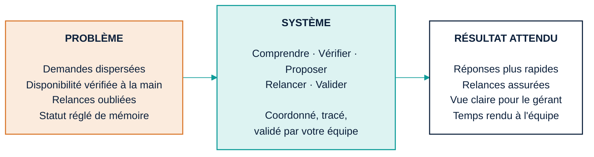

# A — Proposition exécutive en une page

**Message unique :** *Un workflow clair, rapide et supervisé — pour votre équipe, pas à sa place.*
**Formats :** A4 portrait (PDF, impression) · 1080 × 1080 (WhatsApp) · 1080 × 1350 (couverture carrousel LinkedIn)
**Tokens :** voir `00_design_system.md`

---

## 1. Structure du contenu (dans l'ordre de lecture)

1. **Titre + promesse** (2 lignes max)
2. **Triptyque** PROBLÈME → SYSTÈME → RÉSULTAT (3 colonnes, 3–4 lignes chacune)
3. **Avant / Après** (tableau compact, 5 lignes)
4. **Pilote + prochaine étape** (3 étapes + une phrase d'intégrité)
5. **Signature** (identité + contact)

Aucun autre élément. Pas de logo d'outil, pas de mention technique.

---

## 2. Copy français (définitif)

### Titre
**Transformer les demandes clients en un workflow clair, rapide et supervisé.**

### Sous-titre
Une approche pilote pour réduire les tâches répétitives, accélérer les réponses et mieux suivre les opportunités.

### Triptyque

| PROBLÈME | SYSTÈME | RÉSULTAT ATTENDU |
|---|---|---|
| Demandes dispersées : WhatsApp, téléphone, comptoir | Comprendre · Vérifier · Proposer · Relancer · Valider | Réponses plus rapides |
| Disponibilité vérifiée à la main | Coordonné et tracé de bout en bout | Relances qui ne s'oublient plus |
| Devis envoyés, relances oubliées | Votre équipe valide les cas sensibles | Une vue claire pour le gérant |
| « On en est où ? » réglé de mémoire | Rien n'est envoyé sans une personne | Du temps rendu à l'équipe |

### Avant / Après

| | Aujourd'hui | Avec le pilote |
|---|---|---|
| Demande | Lue, recopiée, dates redemandées | Structurée, question courte si besoin |
| Disponibilité | Tableau ouvert, collègue appelé | Vérifiée selon vos règles, alternative proposée |
| Réponse | Rédigée à la main | Brouillon prêt, relu et envoyé par l'équipe |
| Relance | Si quelqu'un s'en souvient | Planifiée et signalée |
| Statut | Dans la tête de chacun | Sur un tableau, en un coup d'œil |

### Pilote et prochaine étape
**1.** Échange de 30 minutes · **2.** Audit court · **3.** Pilote cadré, mesuré, décidé ensemble.

*Aucun chiffre n'est promis avant d'être mesuré chez vous.*

### Signature
**Ingénieur IA & Architecte d'automatisation** — Des workflows intelligents pour les opérations réelles.
[téléphone] · [email] · [LinkedIn]

---

## 3. Hiérarchie visuelle

| Niveau | Élément | Style |
|---|---|---|
| 1 | Titre | Manrope 800, 36 pt (A4) / 64 px (1080²), navy, 2 lignes, aligné gauche |
| 2 | Sous-titre | Manrope 500, 14 pt / 30 px, slate |
| 3 | Étiquettes PROBLÈME / SYSTÈME / RÉSULTAT | Manrope 700, 12 pt, majuscules, tracking +8 %, couleur de colonne |
| 4 | Contenu triptyque | Manrope 500, 12 pt, ink, 4 puces courtes |
| 5 | Tableau Avant/Après | Manrope 400, 11 pt ; en-têtes 700 |
| 6 | Pilote | Manrope 600, 13 pt, trois numéros en pastilles navy |
| 7 | Intégrité | Manrope 400 italique, 10 pt, slate |
| 8 | Signature | Manrope 700, 11 pt, navy ; contact 400, 10 pt, slate |

Le regard doit suivre : titre → colonne PROBLÈME (reconnaissance) → flèches → RÉSULTAT (soulagement) → prochaine étape (action).

---

## 4. Direction couleur

- Fond : `paper`.
- Colonne PROBLÈME : fond `orange-100`, étiquette `orange`, bordure gauche 3 px `orange`. C'est **le seul** usage de l'orange sur la page.
- Colonne SYSTÈME : fond `teal-100`, étiquette `teal`, bordure gauche 3 px `teal`.
- Colonne RÉSULTAT : fond `white`, étiquette `navy`, bordure gauche 3 px `navy`.
- Flèches entre colonnes : `teal`, 2 px, pointe fermée.
- Tableau Avant/Après : colonne « Aujourd'hui » texte `slate`, colonne « Avec le pilote » texte `navy` + pastille `teal` 6 px devant chaque ligne.
- Pastilles numéros du pilote : `navy` plein, chiffre blanc.
- Bandeau signature : trait 1 px `line` au-dessus.

---

## 5. Mise en page

### A4 portrait (210 × 297 mm, marges 18 mm, grille 12 col.)

```
┌──────────────────────────────────────────────────────────┐
│  TITRE (2 lignes, 12 col.)                               │  y 18–46 mm
│  Sous-titre (10 col.)                                    │  y 48–56 mm
│                                                          │
│  PROBLÈME (4c)  →  SYSTÈME (4c)  →  RÉSULTAT (4c)        │  y 66–126 mm
│  ┌────────┐       ┌────────┐       ┌────────┐            │
│  │ • • • •│  ──►  │ • • • •│  ──►  │ • • • •│            │
│  └────────┘       └────────┘       └────────┘            │
│                                                          │
│  AVANT / APRÈS — une journée à l'agence                  │  y 138–208 mm
│  ┌──────────┬──────────────────┬─────────────────────┐   │
│  │          │ Aujourd'hui      │ Avec le pilote      │   │
│  │ 5 lignes │                  │ ● …                 │   │
│  └──────────┴──────────────────┴─────────────────────┘   │
│                                                          │
│  LA PROCHAINE ÉTAPE   ①──────②──────③                    │  y 220–250 mm
│  phrase d'intégrité (italique)                           │
│  ─────────────────────────────────────────────────────── │
│  Signature · contact                                     │  y 262–279 mm
└──────────────────────────────────────────────────────────┘
```

### 1080 × 1080 (WhatsApp / post)

Retirer le tableau Avant/Après (il devient la page 2 du carrousel). Garder : titre (3 lignes max, 64 px), triptyque empilé verticalement **ou** en 3 colonnes si le texte tient à ≥ 28 px, prochaine étape en une ligne, signature.

### 1080 × 1350 (couverture carrousel)

Titre + sous-titre + triptyque en colonnes ; pied « Faites défiler → » discret en `slate`.

---

## 6. Mermaid (structure du triptyque)



---

## 7. Prompt de génération (outil d'image / design)

```
[préfixe commun §9 du design system] Aspect ratio: 3:4 (A4 portrait).

Layout: an executive one-page consulting proposal in French. Top: large bold navy headline
"Transformer les demandes clients en un workflow clair, rapide et supervisé." on two lines, a grey
subtitle beneath. Middle: three equal columns labelled "PROBLÈME", "SYSTÈME", "RÉSULTAT ATTENDU",
connected by two thin teal arrows; the first column has a pale warm-orange background and a thin
orange left border, the second a pale teal background and teal left border, the third white with a
navy left border; each column holds four short bullet lines. Below: a compact five-row table titled
"AVANT / APRÈS — une journée à l'agence" with two columns "Aujourd'hui" (grey text) and "Avec le
pilote" (navy text with tiny teal dots). Bottom: "LA PROCHAINE ÉTAPE" with three numbered navy
circles on a thin line (30 min · Audit court · Pilote mesuré), a small italic integrity line, a
1px divider, and a signature line "Ingénieur IA & Architecte d'automatisation". Editorial grid,
lots of whitespace, no icons except the three numbered circles, no photos, no gradients.
```

---

## 8. Revue finale

| Question | Réponse | Preuve |
|---|---|---|
| Compris en 30 s ? | Oui | Titre + 3 étiquettes + 3 résultats lisibles sans lire les puces |
| Commence par la douleur ? | Oui | Colonne PROBLÈME en premier, orange = seul accent chaud |
| Humain aux commandes ? | Oui | « Votre équipe valide » + « Rien n'est envoyé sans une personne » |
| Architecture simple/fiable ? | Oui | 5 verbes, un fil « coordonné et tracé » |
| Pilote mesurable, sans promesse ? | Oui | Phrase d'intégrité, aucun chiffre |
| Crédible face à un directeur ? | Oui | Aucun jargon, ton de conseil |
| PDF / WhatsApp / LinkedIn / jury ? | Oui | Trois déclinaisons spécifiées |
