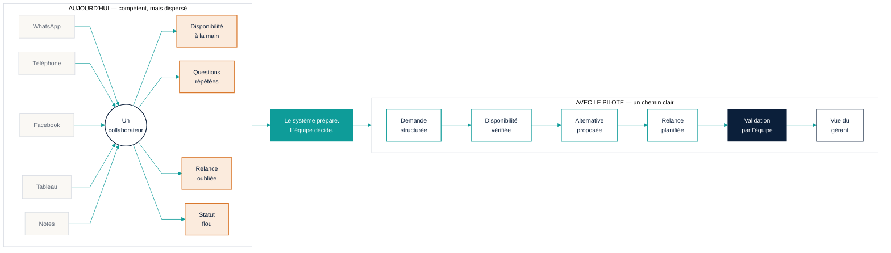

# B — Carte de workflow « Avant / Après »

**Message unique :** *Même équipe, mêmes responsabilités — moins de friction, plus de contrôle.*
**Formats :** A4 paysage · 1080 × 1080 (deux pages : Avant / Après) · 16:9
**Tokens :** `00_design_system.md`

---

## 1. Structure du contenu

Deux moitiés, une flèche centrale unique.

**Gauche — AUJOURD'HUI (friction)**
- Titre : *Aujourd'hui : compétent, mais dispersé.*
- 5 canaux d'entrée convergeant vers une seule personne : WhatsApp · Téléphone · Facebook · Tableau Excel · Notes papier
- 5 points de friction (pastilles orange) :
  1. Demandes dispersées sur plusieurs canaux
  2. Disponibilité vérifiée à la main
  3. Mêmes questions, mêmes réponses, chaque jour
  4. Relance oubliée après devis
  5. Statut flou, coordination fragmentée

**Centre — la transition**
- Une flèche large, `teal`, avec le libellé : *Le système prépare. L'équipe décide.*

**Droite — AVEC LE PILOTE (workflow calme)**
- Titre : *Avec le pilote : un chemin clair.*
- 6 étapes en ligne, pastilles teal :
  1. Demande captée et structurée
  2. Disponibilité vérifiée selon vos règles
  3. Alternative proposée si besoin
  4. Relance planifiée
  5. Cas exceptionnels validés par l'équipe *(bloc navy, pictogramme personne)*
  6. Le gérant voit l'état en un coup d'œil *(bloc navy contour)*

---

## 2. Copy français

| Zone | Texte |
|---|---|
| Titre général | **Une journée à l'agence — avant et avec le pilote** |
| Sous-titre | La même équipe. Le même métier. Moins de friction. |
| Gauche, titre | Aujourd'hui : compétent, mais dispersé |
| Gauche, canaux | WhatsApp · Téléphone · Facebook · Tableau · Notes |
| Gauche, personne | *Un collaborateur, cinq sources, une mémoire* |
| Gauche, frictions | Demandes dispersées · Disponibilité à la main · Questions répétées · Relance oubliée · Statut flou |
| Flèche centrale | Le système prépare. L'équipe décide. |
| Droite, titre | Avec le pilote : un chemin clair |
| Droite, étapes | Demande structurée → Disponibilité vérifiée → Alternative proposée → Relance planifiée → Validation par l'équipe → Vue du gérant |
| Légende | ● orange = friction actuelle · ● teal = étape préparée par le système · ■ navy = décision humaine |
| Pied | Hypothèses à confirmer lors de l'audit — le pilote mesure avant et après. |

---

## 3. Hiérarchie visuelle

1. Titre général (Manrope 800, 28 pt / 56 px, navy).
2. Deux titres de moitié (700, 18 pt, gauche en navy avec un souligné orange 3 px ; droite en navy avec souligné teal 3 px).
3. Flèche centrale : l'élément le plus large de la page, seule zone teal plein en dehors des pastilles.
4. Étapes / frictions : 12–13 pt, une ligne chacune.
5. Légende et pied : 9–10 pt, slate.

Densité : la gauche est **visuellement plus dense** (cinq flèches convergentes, lignes fines qui se croisent une fois) mais reste alignée sur la grille. La droite est **linéaire, espacée**, une seule ligne horizontale teal. La différence de densité *est* le message ; pas besoin d'effet « chaos ».

---

## 4. Direction couleur

| Élément | Couleur | Sens |
|---|---|---|
| Fond global | `paper` | — |
| Bloc gauche | `white` avec bordure 1 px `line` | Neutre : on ne diabolise pas l'existant |
| Canaux (gauche) | pictogrammes contour `navy`, traits fins `slate` convergents | Ce sont des outils légitimes |
| Silhouette collaborateur | `navy` contour, centrée | Personne compétente, respectée |
| Pastilles friction | `orange` 8 px + texte `ink` | Friction, pas faute |
| Flèche centrale | `teal` plein, texte blanc | Le changement |
| Ligne de workflow (droite) | `teal` 2 px | Flux préparé par le système |
| Étapes 1–4 | `white`, bordure `teal` 1,5 px, pastille `teal` | Système |
| Étape 5 (validation) | `navy` plein, texte blanc, pictogramme personne | Humain décide |
| Étape 6 (gérant) | `white`, bordure `navy` 1,5 px | Visibilité humaine |

Interdit : rouge, fonds sombres dramatiques à gauche, éclairs, points d'exclamation.

---

## 5. Mise en page

### A4 paysage (297 × 210 mm)

```
┌────────────────────────────────────────────────────────────────────────────┐
│ Une journée à l'agence — avant et avec le pilote                           │
│ La même équipe. Le même métier. Moins de friction.                         │
├──────────────────────────────┬───────┬─────────────────────────────────────┤
│ AUJOURD'HUI                  │       │ AVEC LE PILOTE                      │
│                              │       │                                     │
│  WhatsApp ─┐                 │  ═══  │  ● Demande structurée               │
│  Téléphone ─┤                │  ═══► │  ● Disponibilité vérifiée           │
│  Facebook ──┼─► [personne]   │  ═══  │  ● Alternative proposée             │
│  Tableau ───┤                │       │  ● Relance planifiée                │
│  Notes ─────┘                │ Le    │  ■ Validation par l'équipe          │
│                              │système│  □ Vue du gérant                    │
│  ● Demandes dispersées       │prépare│                                     │
│  ● Disponibilité à la main   │L'équi-│  ───── ligne teal continue ─────►   │
│  ● Questions répétées        │  pe   │                                     │
│  ● Relance oubliée           │décide │                                     │
│  ● Statut flou               │       │                                     │
├──────────────────────────────┴───────┴─────────────────────────────────────┤
│ Légende ● ● ■        Hypothèses à confirmer lors de l'audit.               │
└────────────────────────────────────────────────────────────────────────────┘
```

Proportions : gauche 42 % · centre 10 % · droite 48 %. La droite est légèrement plus large : le futur prend plus de place que le passé.

### 1080 × 1080
Deux images distinctes (page 1 : Aujourd'hui ; page 2 : Avec le pilote), même titre, avec un indicateur « 1/2 » « 2/2 ». La flèche centrale devient le bas de la page 1 (« Et avec le pilote ? → »).

---

## 6. Mermaid

Version exécutive (deux sous-graphes) :



---

## 7. Prompt de génération

```
[préfixe commun] Aspect ratio: 16:9.

A two-panel editorial infographic in French titled "Une journée à l'agence — avant et avec le pilote".
LEFT PANEL (42% width, white card, thin grey border): heading "Aujourd'hui : compétent, mais dispersé"
with a thin orange underline; five small outline icons in a vertical column (chat bubble, phone,
social "f", spreadsheet grid, paper note) with thin grey lines converging on a single outline
silhouette of a professional person at a desk in navy; below, five short lines each preceded by a
small muted-orange dot: "Demandes dispersées", "Disponibilité à la main", "Questions répétées",
"Relance oubliée", "Statut flou". Dense but tidy, aligned to a grid.
CENTRE (10%): one wide solid teal arrow pointing right, white text inside "Le système prépare.
L'équipe décide."
RIGHT PANEL (48%): heading "Avec le pilote : un chemin clair" with a thin teal underline; a single
horizontal teal line with six evenly spaced steps: four white cards with teal borders and teal dots
("Demande structurée", "Disponibilité vérifiée", "Alternative proposée", "Relance planifiée"), then
one solid navy card with a white outline person icon ("Validation par l'équipe"), then a white card
with navy border ("Vue du gérant"). Generous whitespace, calm.
FOOTER: tiny legend with three dots (orange, teal, navy square) and the line "Hypothèses à confirmer
lors de l'audit — le pilote mesure avant et après." No red, no chaos effects, no exclamation marks.
```

---

## 8. Revue finale

| Question | Réponse | Preuve |
|---|---|---|
| 30 secondes ? | Oui | Deux titres, une flèche, deux listes courtes |
| Douleur d'abord ? | Oui | Lecture gauche → droite, la friction est le point d'entrée |
| Humain aux commandes ? | Oui | Bloc navy « Validation par l'équipe » + silhouette respectée à gauche |
| Simple et fiable ? | Oui | Une seule ligne de workflow, six étapes |
| Mesurable, sans promesse ? | Oui | Pied « hypothèses à confirmer », aucun chiffre |
| Crédible directeur ? | Oui | Densité maîtrisée, pas de « chaos » caricatural |
| Multi-format ? | Oui | A4 paysage, 16:9, 1080² en deux pages |
