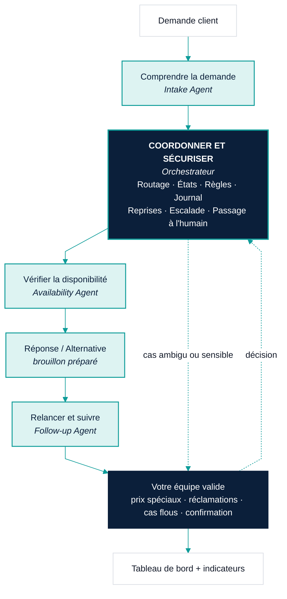
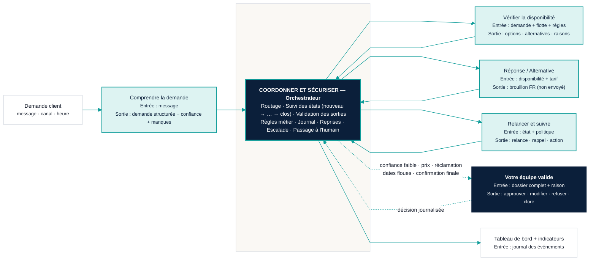

# C — Architecture multi-agents (système fiable, pas boîte noire)

**Message unique :** *Un système opérationnel fiable : trois assistants spécialisés, un coordinateur qui sécurise tout, votre équipe qui décide.*
**Formats :** A4 portrait (proposition) · 16:9 (jury, réunion)
**Deux versions :** exécutive (7 blocs, libellés métier) et technique (mêmes blocs + entrées/sorties/points de validation).
**Tokens :** `00_design_system.md`

---

## 1. Structure du contenu

Colonne verticale, de haut en bas, exactement ces composants :

```
Demande client
   ↓
Comprendre la demande          (Intake Agent)
   ↓
Coordonner et sécuriser        (Orchestrateur / Middleware)   ← colonne vertébrale
   ↓
Vérifier la disponibilité      (Availability Agent)
   ↓
Réponse / Alternative
   ↓
Relancer et suivre             (Follow-up Agent)
   ↓
Validation humaine si nécessaire
   ↓
Tableau de bord + indicateurs
```

L'orchestrateur n'est pas un simple bloc dans la chaîne : il est dessiné comme une **barre verticale navy** qui longe toute la colonne, avec un bloc principal à sa position dans la séquence. Chaque agent est **branché** sur cette barre (entrée et sortie). La validation humaine est reliée à la barre par une flèche pointillée dans les deux sens.

---

## 2. Fiche de chaque composant (version technique, libellés métier)

| Composant | Raison d'être (métier) | Entrée | Sortie | Décision / validation |
|---|---|---|---|---|
| **Demande client** | Point de départ : WhatsApp, appel, formulaire, comptoir | Message brut, canal, heure | — | — |
| **Comprendre la demande** *(Intake Agent)* | Transformer un message flou en demande complète | Message, profil client connu | Demande structurée + niveau de confiance + champs manquants + question courte si besoin | Aucune décision. Confiance faible → orchestrateur transmet à l'équipe |
| **Coordonner et sécuriser** *(Orchestrateur)* | Garantir qu'aucune demande ne se perd et qu'aucune décision sensible n'est prise sans une personne | Toutes les sorties d'agents, actions de l'équipe, temps | État de chaque demande, journal, file de validation, données du tableau de bord | Routage · suivi des états · règles métier · journalisation · reprises · escalade · passage à l'humain |
| **Vérifier la disponibilité** *(Availability Agent)* | Répondre vrai : disponible, alternative, ou pourquoi non | Demande complète, table de flotte, règles (durée, catégorie, maintenance, lieu) | Options · alternatives · raisons | Aucune IA générative ici : règles mécaniques. Résultat toujours explicable |
| **Réponse / Alternative** | Ce que le client recevra — préparé, pas envoyé | Résultat de disponibilité + tarif de la table | Brouillon de réponse en français | L'équipe relit, modifie, envoie |
| **Relancer et suivre** *(Follow-up Agent)* | Qu'aucun devis ne meure en silence | État, horodatage, politique de relance | Brouillon de relance · rappel planifié · prochaine action recommandée (répondre, relancer, appeler, escalader, clore) | Recommandation seulement ; l'équipe exécute |
| **Validation humaine si nécessaire** *(Équipe)* | Décider ce qui engage l'agence | Dossier complet : message, demande structurée, disponibilité, brouillon, raison de l'escalade | Décision : approuver · modifier · refuser · réassigner · clore | Prix spéciaux, réclamations, dates floues, clients sensibles, confirmation finale |
| **Tableau de bord + indicateurs** | Le gérant voit l'état sans demander | Journal des événements | Colonnes d'état · indicateurs calculés | Lecture seule ; les chiffres viennent des horodatages, jamais saisis à la main |

---

## 3. Copy français

| Zone | Texte |
|---|---|
| Titre | **Un système simple, coordonné, supervisé** |
| Sous-titre | Trois assistants spécialisés. Un coordinateur qui sécurise. Votre équipe qui décide. |
| Barre orchestrateur (étiquette verticale) | COORDONNER ET SÉCURISER |
| Bloc orchestrateur (liste) | Routage · États · Règles · Journal · Reprises · Escalade · Passage à l'humain |
| Bloc validation humaine | Votre équipe valide — prix spéciaux, réclamations, cas flous, confirmation |
| Note de bas | Rien n'est envoyé au client sans une personne. Le système ne devine jamais une disponibilité. |
| Légende | ▭ teal = assistant spécialisé · ▮ navy = coordinateur / humain · ⇢ pointillé = passage à l'équipe |

---

## 4. Hiérarchie visuelle

1. La **barre navy** de l'orchestrateur — l'élément le plus visible, avec son étiquette verticale en majuscules. C'est le message : « il y a une colonne vertébrale ».
2. Les trois blocs agents en `teal-100`, même taille, alignés à gauche de la barre.
3. Le bloc « Validation humaine » en navy plein, à droite de la barre, à hauteur de « Relancer et suivre » — visiblement hors de la chaîne automatique, relié en pointillé.
4. Demande client (haut) et Tableau de bord (bas) en blanc, bordure fine : les extrémités humaines.
5. Version technique : sous chaque bloc, deux lignes 9–10 pt slate : « Entrée : … » / « Sortie : … ».

---

## 5. Direction couleur

| Élément | Couleur | Sens |
|---|---|---|
| Barre + bloc orchestrateur | `navy` plein, bord `teal` 2 px, texte blanc | Structure fiable, sécurité |
| Agents | `teal-100` fond, bord `teal` 1,5 px, titre `navy`, nom d'agent en italique `slate` | Système, action |
| Réponse / Alternative | `white`, bord `teal` | Sortie du système, pas encore envoyée |
| Validation humaine | `navy` plein, pictogramme personne contour blanc | Humain décide |
| Demande client / Tableau de bord | `white`, bord `line` | Entrée / sortie métier |
| Flèches de flux | `teal` 2 px pleines | Flux normal |
| Flèches d'escalade | `navy` 2 px pointillées, double sens | Passage à l'humain et retour |
| Aucun orange | — | Ce visuel montre l'état futur : pas de friction à marquer |

Interdit : cerveau, ampoules, réseaux de neurones, nuages, engrenages lumineux, rayons.

---

## 6. Mise en page

### A4 portrait — version exécutive

```
┌──────────────────────────────────────────────────────────────┐
│ Un système simple, coordonné, supervisé                      │
│ Trois assistants spécialisés. Un coordinateur. Votre équipe. │
│                                                              │
│         ┌──────────────────┐                                 │
│         │  Demande client  │                                 │
│         └────────┬─────────┘                                 │
│                  ▼                                           │
│   ┌──────────────────────┐  ║                                │
│   │ Comprendre la demande│──╢                                │
│   └──────────────────────┘  ║ C                              │
│                             ║ O   ┌────────────────────┐     │
│   ┌──────────────────────┐  ║ O   │   COORDONNER ET    │     │
│   │ Vérifier la dispo    │──╢ R   │    SÉCURISER       │     │
│   └──────────────────────┘  ║ D   │ Routage · États    │     │
│                             ║ O   │ Règles · Journal   │     │
│   ┌──────────────────────┐  ║ N   │ Reprises · Escalade│     │
│   │ Réponse / Alternative│──╢ N   └────────────────────┘     │
│   └──────────────────────┘  ║ E                              │
│                             ║ R          ┌────────────────┐  │
│   ┌──────────────────────┐  ║  ⇠ ⇢       │ Votre équipe   │  │
│   │ Relancer et suivre   │──╢ ─ ─ ─ ─ ─ ─│ valide         │  │
│   └──────────────────────┘  ║            └────────────────┘  │
│                             ║                                │
│                  ▼                                           │
│         ┌──────────────────────────┐                         │
│         │ Tableau de bord + KPI    │                         │
│         └──────────────────────────┘                         │
│                                                              │
│ Rien n'est envoyé au client sans une personne.               │
└──────────────────────────────────────────────────────────────┘
```

### 16:9 — version technique
Même structure, tournée en horizontal (flux gauche → droite), barre orchestrateur horizontale sous les agents, validation humaine au-dessus, fiches entrée/sortie sous chaque bloc.

---

## 7. Mermaid

### 7.1 Version exécutive



### 7.2 Version technique (entrées / sorties visibles)



---

## 8. Prompt de génération

```
[préfixe commun] Aspect ratio: 3:4.

A premium, reliable-looking operational system diagram in French, vertical flow. Title "Un système
simple, coordonné, supervisé". A single top white card "Demande client". Down the centre-right runs
a tall solid navy vertical bar with a thin teal edge and the vertical uppercase label "COORDONNER ET
SÉCURISER"; midway on this bar sits a navy block listing in small white text "Routage · États ·
Règles · Journal · Reprises · Escalade · Passage à l'humain". To the left of the bar, four equal
pale-teal cards with teal borders stacked vertically and each connected to the bar by a short teal
line: "Comprendre la demande", "Vérifier la disponibilité", "Réponse / Alternative", "Relancer et
suivre"; under each title a small grey italic agent name. To the right of the bar, one solid navy
card with a white outline person icon, "Votre équipe valide — prix spéciaux, réclamations, cas flous,
confirmation", linked to the bar by a dashed navy double-headed arrow. At the bottom, a white card
"Tableau de bord + indicateurs". Footer line: "Rien n'est envoyé au client sans une personne."
Engineering-schematic clarity, editorial whitespace, thin lines, flat, absolutely no brain, no
glowing nodes, no neural network, no gears, no robot.
```

---

## 9. Revue finale

| Question | Réponse | Preuve |
|---|---|---|
| 30 secondes ? | Oui (exécutive) | 7 blocs, un flux, une barre |
| Douleur d'abord ? | Oui dans la séquence globale (vient après A et B) ; ici titre orienté fiabilité, pas techno | Pas de nom technique en niveau 1 |
| Humain aux commandes ? | Oui | Bloc navy hors chaîne, double flèche pointillée, note de bas |
| Simple et fiable ? | Oui | Barre orchestrateur = colonne vertébrale explicite, liste des sécurités |
| Sans promesse ? | Oui | Aucun chiffre |
| Crédible directeur ? | Oui | Schéma d'exploitation, pas de sci-fi |
| Multi-format ? | Oui | A4 exécutive + 16:9 technique |
