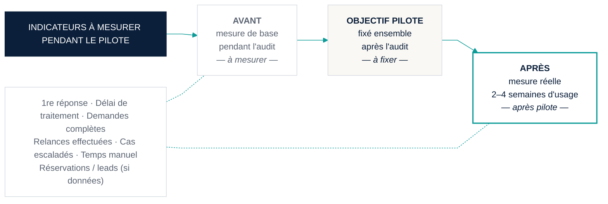

# E — Tableau d'impact KPI (mesuré, pas promis)

**Message unique :** *Nous mesurons avant, nous fixons un objectif ensemble, nous mesurons après. Rien n'est promis.*
**Formats :** 16:9 (jury, réunion) · A4 portrait (annexe proposition) · 1080 × 1080 (page carrousel)
**Tokens :** `00_design_system.md`

---

## 1. Structure du contenu

Bandeau obligatoire en haut : **« Indicateurs à mesurer pendant le pilote »** — jamais « Résultats ».

Sept tuiles, chacune avec trois colonnes :

| | Avant | Objectif pilote | Après (mesure réelle) |
|---|---|---|---|

Toutes les cellules de valeur sont des **placeholders** : `— à mesurer —` (Avant), `— à fixer ensemble —` (Objectif), `— après pilote —` (Après). La ligne « Réservations / leads qualifiés » porte la mention *si données disponibles*.

Sous le tableau : une ligne « Comment on mesure » par indicateur (méthode courte), et la note d'intégrité.

---

## 2. Copy français

| Zone | Texte |
|---|---|
| Bandeau | **INDICATEURS À MESURER PENDANT LE PILOTE** |
| Sous-titre | Une base honnête, un objectif fixé ensemble, une mesure réelle. |
| Colonnes | AVANT · OBJECTIF PILOTE · APRÈS (MESURE RÉELLE) |
| Note d'intégrité | Aucun résultat n'est annoncé avant d'être mesuré dans votre agence. Les objectifs sont fixés avec vous après l'audit. |

### Les sept tuiles

| # | Indicateur | Ce qu'il mesure (sous-titre de tuile) | Méthode de mesure |
|---|---|---|---|
| 1 | **Temps de première réponse** | Entre l'arrivée de la demande et la première réponse envoyée | Horodatage réception → envoi ; ≥ 5 demandes par période |
| 2 | **Délai de traitement d'une demande** | De la demande au devis prêt | Horodatage réception → « devis prêt » |
| 3 | **Taux de demandes complètes** | Part des demandes avec dates, catégorie et lieu dès le premier échange | Champs manquants = 0 au premier passage |
| 4 | **Taux de relances effectuées** | Devis sans réponse ayant reçu au moins une relance | Relances faites ÷ relances dues |
| 5 | **Cas escaladés à un humain** | Demandes transmises à l'équipe, par motif | Compte par motif — *c'est une sécurité, pas un défaut* |
| 6 | **Temps manuel par demande** | Minutes de travail de l'équipe par demande | Chronométrage échantillonné, même protocole avant/après |
| 7 | **Réservations ou leads qualifiés** *(si données disponibles)* | Demandes ayant abouti | Selon les données que l'agence accepte de partager |

---

## 3. Hiérarchie visuelle

1. Bandeau navy pleine largeur, texte blanc en majuscules : c'est le cadre de lecture, il empêche toute lecture « résultats ».
2. Sept tuiles en grille (16:9 : 4 + 3 ; A4 : 7 lignes ; 1080² : 7 lignes compactes).
3. Dans chaque tuile : titre (Manrope 700, 14 pt), sous-titre (400, 10 pt slate), puis trois cellules de valeur en tabular-nums 800, 20 pt — mais **contenant un tiret cadratin et un texte gris**, pas un chiffre.
4. Colonne « Après » légèrement mise en avant (bordure teal), car c'est la seule qui comptera.
5. Ligne « Comment on mesure » sous chaque tuile, 9 pt.
6. Note d'intégrité en pied, italique, slate.

---

## 4. Direction couleur

| Élément | Couleur | Sens |
|---|---|---|
| Bandeau | `navy` plein, texte blanc | Cadre, sérieux |
| Tuiles | `white`, bord `line` 1 px, coin 4 px | Neutre |
| Colonne Avant | texte `slate` | Base, passé |
| Colonne Objectif | texte `navy`, fond `paper` | Engagement partagé |
| Colonne Après | texte `navy`, bord haut `teal` 3 px | Ce qui sera réel |
| Tuile 5 (escaladés) | petit pictogramme personne `navy` | Rappel : c'est humain, c'est voulu |
| Placeholders | `slate`, italique | Visiblement vides |
| Aucun vert, aucun rouge, aucune flèche haut/bas | — | On n'indique aucune direction avant mesure |

---

## 5. Mise en page

### 16:9

```
┌────────────────────────────────────────────────────────────────────────────┐
│ ████████ INDICATEURS À MESURER PENDANT LE PILOTE ████████████████████████  │
│ Une base honnête, un objectif fixé ensemble, une mesure réelle.            │
│                                                                            │
│ ┌──────────────┐ ┌──────────────┐ ┌──────────────┐ ┌──────────────┐        │
│ │ Temps de 1re │ │ Délai de     │ │ Taux de      │ │ Taux de      │        │
│ │ réponse      │ │ traitement   │ │ demandes     │ │ relances     │        │
│ │ Avant Obj Apr│ │ Avant Obj Apr│ │ complètes    │ │ effectuées   │        │
│ │  —    —   —  │ │  —    —   —  │ │  —    —   —  │ │  —    —   —  │        │
│ │ méthode      │ │ méthode      │ │ méthode      │ │ méthode      │        │
│ └──────────────┘ └──────────────┘ └──────────────┘ └──────────────┘        │
│ ┌──────────────┐ ┌──────────────┐ ┌──────────────┐                         │
│ │ Cas escaladés│ │ Temps manuel │ │ Réservations │                         │
│ │ à un humain ▣│ │ par demande  │ │ ou leads *   │                         │
│ │  —    —   —  │ │  —    —   —  │ │  —    —   —  │                         │
│ └──────────────┘ └──────────────┘ └──────────────┘                         │
│                                                                            │
│ * si données disponibles                                                   │
│ Aucun résultat n'est annoncé avant d'être mesuré dans votre agence.        │
└────────────────────────────────────────────────────────────────────────────┘
```

### A4 portrait
Tableau à 7 lignes × 4 colonnes (Indicateur · Avant · Objectif · Après) + colonne « Méthode » en 9 pt. Bandeau en haut, note en bas.

---

## 6. Mermaid (logique de mesure — pour le brief, pas pour le rendu final)



---

## 7. Prompt de génération

```
[préfixe commun] Aspect ratio: 16:9.

A restrained KPI board in French for a business pilot, designed to look honest rather than
impressive. Full-width solid navy banner at the top with white uppercase text "INDICATEURS À MESURER
PENDANT LE PILOTE", grey subtitle beneath "Une base honnête, un objectif fixé ensemble, une mesure
réelle." A grid of seven white tiles with thin grey borders (four on the first row, three on the
second): "Temps de première réponse", "Délai de traitement d'une demande", "Taux de demandes
complètes", "Taux de relances effectuées", "Cas escaladés à un humain" (with a tiny navy outline
person icon), "Temps manuel par demande", "Réservations ou leads qualifiés *". Inside every tile,
three small column headers "AVANT", "OBJECTIF PILOTE", "APRÈS (MESURE RÉELLE)" — the third with a
thin teal top border — and beneath each header a large grey em-dash placeholder in bold tabular
numerals, with tiny italic grey text "à mesurer" / "à fixer ensemble" / "après pilote". A one-line
grey "méthode" note at the bottom of each tile. Footer: "* si données disponibles" and an italic
line "Aucun résultat n'est annoncé avant d'être mesuré dans votre agence." Absolutely no numbers,
no percentages, no up/down arrows, no green or red, no charts with values.
```

---

## 8. Revue finale

| Question | Réponse | Preuve |
|---|---|---|
| 30 secondes ? | Oui | Bandeau + 7 titres + 3 colonnes |
| Douleur d'abord ? | Oui (indirect) | Chaque indicateur nomme une friction (relance, temps manuel) |
| Humain aux commandes ? | Oui | Tuile « cas escaladés » présentée comme une sécurité |
| Simple et fiable ? | Oui | Méthode de mesure visible sous chaque tuile |
| Sans promesse ? | **Oui — c'est le cœur du visuel** | Aucun chiffre, aucune flèche, note d'intégrité |
| Crédible directeur ? | Oui | Un directeur se méfie des promesses ; ici il voit une méthode |
| Multi-format ? | Oui | 16:9, A4, 1080² |
