# F — Feuille de route du pilote (six étapes, une décision)

**Message unique :** *Un chemin court, cadré, réversible — vous décidez à la fin, sur des chiffres.*
**Formats :** A4 paysage · 16:9 · 1080 × 1350 (dernière page du carrousel, avec appel à l'action)
**Tokens :** `00_design_system.md`

---

## 1. Structure du contenu

Une ligne de temps horizontale, six jalons. Pour chaque jalon, **trois lignes** : le nom de l'étape, le livrable (ce que vous recevez), le résultat métier (ce que ça change pour vous).

Le sixième jalon est visuellement différent : c'est un **point de décision** (losange navy), pas une étape de plus. Après lui, deux branches courtes : *Continuer* / *Ajuster* / *Arrêter* — toutes acceptables.

Un bloc d'appel à l'action sous la ligne : *Première étape : 30 minutes.*

---

## 2. Copy français

| Zone | Texte |
|---|---|
| Titre | **Le pilote en six étapes** |
| Sous-titre | Court, cadré, mesuré — et réversible à chaque étape. |
| Durées (indicatif) | Sem. 1 · Sem. 2 · Sem. 3–5 · Sem. 6 · Sem. 7–10 · Sem. 11 |
| Appel à l'action | **Première étape : un échange de 30 minutes.** À l'agence ou par téléphone, quand cela vous convient. |
| Pied | Durées indicatives, ajustées après l'audit. Aucun engagement au-delà de l'étape en cours. |

### Les six jalons

| # | Étape | Livrable (ce que vous recevez) | Résultat métier (ce que ça change) | Durée indicative |
|---|---|---|---|---|
| 1 | **Audit court** | Une demi-journée d'observation + un tableau de vos frictions réelles, chiffrées | Vous savez précisément où le temps part — même si vous arrêtez là | Semaine 1 |
| 2 | **Cartographie du workflow** | Un schéma « comment une demande circule » aujourd'hui et demain, validé avec votre équipe | Une vision partagée, sans outil à installer | Semaine 2 |
| 3 | **Prototype supervisé** | Un système fonctionnel sur vos cas types, avec file de validation pour l'équipe | Vous voyez le principe fonctionner, pas des slides | Semaines 3–5 |
| 4 | **Démonstration avec cas réels ou simulés** | Une session où le système traite des demandes devant vous et votre équipe | Objections concrètes, ajustements notés | Semaine 6 |
| 5 | **Mesure des indicateurs** | Le tableau Avant / Objectif / Après rempli avec vos données, limites incluses | Des chiffres à vous, comparables | Semaines 7–10 |
| 6 | **Ajustement et décision** ◇ | Une réunion, un document d'une page, une recommandation honnête | Vous décidez : continuer, ajuster, arrêter | Semaine 11 |

---

## 3. Hiérarchie visuelle

1. Titre + sous-titre.
2. La ligne de temps : trait `teal` 3 px, six jalons. Les jalons 1–5 sont des cercles `navy` numérotés (blanc), le jalon 6 est un **losange navy** plus grand.
3. Sous chaque jalon, une carte blanche à trois lignes : **Étape** (700, 14 pt), *Livrable* (400, 11 pt, précédé d'un petit label « Vous recevez »), *Résultat* (500, 11 pt navy, précédé de « Ça change »).
4. Au-dessus de la ligne, les durées en 9 pt `slate`.
5. Sous le jalon 6, trois petites branches : Continuer · Ajuster · Arrêter (texte 10 pt, traits fins navy). Aucune n'est colorée en « bon » ou « mauvais ».
6. Bloc d'appel à l'action en bas : fond `teal-100`, texte navy 700 : « Première étape : un échange de 30 minutes. »

---

## 4. Direction couleur

| Élément | Couleur | Sens |
|---|---|---|
| Ligne de temps | `teal` 3 px | Progression |
| Jalons 1–5 | `navy` plein, chiffre blanc | Étapes structurées |
| Jalon 6 | `navy` losange, bord `teal` 2 px | Décision — humaine |
| Cartes | `white`, bord `line` | Neutre |
| Label « Vous recevez » | `slate` | — |
| Label « Ça change » | `teal` | Valeur |
| Branches finales | traits `navy` fins, texte `ink` | Toutes légitimes |
| Appel à l'action | fond `teal-100`, texte `navy` | Action positive, sans pression |
| Aucun orange | — | La route est l'état futur |

---

## 5. Mise en page

### A4 paysage / 16:9

```
┌────────────────────────────────────────────────────────────────────────────────┐
│ Le pilote en six étapes                                                        │
│ Court, cadré, mesuré — et réversible à chaque étape.                           │
│                                                                                │
│   Sem. 1     Sem. 2      Sem. 3–5     Sem. 6       Sem. 7–10     Sem. 11       │
│ ───①──────────②───────────③────────────④─────────────⑤────────────◇───────     │
│ ┌───────┐  ┌───────┐   ┌───────┐    ┌───────┐    ┌───────┐    ┌───────┐        │
│ │Audit  │  │Carto- │   │Proto- │    │Démons-│    │Mesure │    │Ajuste-│        │
│ │court  │  │graphie│   │type   │    │tration│    │des    │    │ment & │        │
│ │       │  │       │   │super- │    │       │    │indica-│    │déci-  │        │
│ │Vous   │  │Vous   │   │visé   │    │Vous   │    │teurs  │    │sion   │        │
│ │recevez│  │recevez│   │       │    │recevez│    │       │    │       │        │
│ │…      │  │…      │   │…      │    │…      │    │…      │    │…      │        │
│ │Ça     │  │Ça     │   │Ça     │    │Ça     │    │Ça     │    │Ça     │        │
│ │change │  │change │   │change │    │change │    │change │    │change │        │
│ └───────┘  └───────┘   └───────┘    └───────┘    └───────┘    └───┬───┘        │
│                                                          Continuer│Ajuster│Arrêter│
│                                                                                │
│ ┌──────────────────────────────────────────────────────────────────────────┐   │
│ │ Première étape : un échange de 30 minutes.  À l'agence ou par téléphone. │   │
│ └──────────────────────────────────────────────────────────────────────────┘   │
│ Durées indicatives, ajustées après l'audit. Aucun engagement au-delà de        │
│ l'étape en cours.                                                              │
└────────────────────────────────────────────────────────────────────────────────┘
```

### 1080 × 1350 (page finale carrousel)
Ligne de temps verticale, six cartes empilées, losange en bas, appel à l'action en bandeau plein bas de page avec « Écrivez-moi → ».

---

## 6. Mermaid

```mermaid
%%{init: {"theme":"base","themeVariables":{"fontFamily":"Manrope, Inter, system-ui","fontSize":"13px","lineColor":"#0E9C99","primaryColor":"#FFFFFF","primaryBorderColor":"#D8DCE3","primaryTextColor":"#111827","background":"#FAF8F4"},"flowchart":{"curve":"linear","nodeSpacing":28,"rankSpacing":36}}}%%
flowchart LR
    classDef step fill:#FFFFFF,color:#111827,stroke:#D8DCE3;
    classDef decision fill:#0B1F3A,color:#FFFFFF,stroke:#0E9C99,stroke-width:2px;
    classDef outcome fill:#FAF8F4,color:#0B1F3A,stroke:#0B1F3A;
    classDef cta fill:#DDF3F2,color:#0B1F3A,stroke:#0E9C99,stroke-width:1.5px;

    S1["<b>1 · Audit court</b><br/><span style='color:#5B6472'>Vous recevez :</span> frictions chiffrées<br/><span style='color:#0E9C99'>Ça change :</span> vous savez où part le temps"]:::step
    S2["<b>2 · Cartographie</b><br/><span style='color:#5B6472'>Vous recevez :</span> schéma du workflow<br/><span style='color:#0E9C99'>Ça change :</span> vision partagée"]:::step
    S3["<b>3 · Prototype supervisé</b><br/><span style='color:#5B6472'>Vous recevez :</span> système sur vos cas types<br/><span style='color:#0E9C99'>Ça change :</span> le principe fonctionne"]:::step
    S4["<b>4 · Démonstration</b><br/><span style='color:#5B6472'>Vous recevez :</span> session cas réels/simulés<br/><span style='color:#0E9C99'>Ça change :</span> objections concrètes"]:::step
    S5["<b>5 · Mesure des KPI</b><br/><span style='color:#5B6472'>Vous recevez :</span> Avant / Objectif / Après<br/><span style='color:#0E9C99'>Ça change :</span> des chiffres à vous"]:::step
    S6{"<b>6 · Décision</b><br/>Continuer · Ajuster · Arrêter"}:::decision
    C["<b>Première étape : 30 minutes.</b>"]:::cta

    C --> S1 --> S2 --> S3 --> S4 --> S5 --> S6
```



---

## 7. Prompt de génération

```
[préfixe commun] Aspect ratio: 16:9.

A professional consulting roadmap in French titled "Le pilote en six étapes", subtitle "Court,
cadré, mesuré — et réversible à chaque étape." A single horizontal teal timeline across the page
with six milestones: five solid navy numbered circles (1–5) and a sixth larger navy diamond with a
thin teal edge. Small grey week labels above each milestone ("Sem. 1", "Sem. 2", "Sem. 3–5",
"Sem. 6", "Sem. 7–10", "Sem. 11"). Under each milestone a white card with a thin grey border holding
three lines: a bold step name ("Audit court", "Cartographie du workflow", "Prototype supervisé",
"Démonstration", "Mesure des indicateurs", "Ajustement et décision"), a grey line starting with
"Vous recevez :", and a navy line starting with a teal "Ça change :". Under the diamond, three short
thin navy branches labelled "Continuer", "Ajuster", "Arrêter" with no colour judgement. At the
bottom, a pale teal band with navy bold text "Première étape : un échange de 30 minutes." and a tiny
grey footer "Durées indicatives, ajustées après l'audit. Aucun engagement au-delà de l'étape en
cours." Editorial grid, flat, whitespace, no icons other than numbers and the diamond.
```

---

## 8. Revue finale

| Question | Réponse | Preuve |
|---|---|---|
| 30 secondes ? | Oui | Six jalons, trois lignes chacun, un appel à l'action |
| Douleur d'abord ? | Oui (via A/B avant) ; ici l'étape 1 est « vos frictions chiffrées » | Le premier livrable est un diagnostic, pas un outil |
| Humain aux commandes ? | Oui | Losange de décision, trois issues toutes acceptables |
| Simple et fiable ? | Oui | Durées indicatives, livrables concrets |
| Sans promesse ? | Oui | Aucun chiffre, « réversible à chaque étape » |
| Crédible directeur ? | Oui | Ton de gouvernance de projet |
| Multi-format ? | Oui | A4 paysage, 16:9, 1080 × 1350 |
